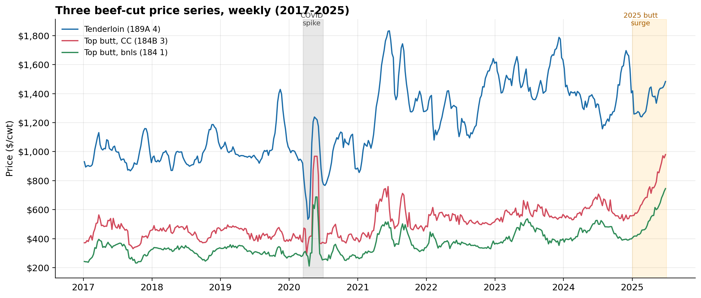
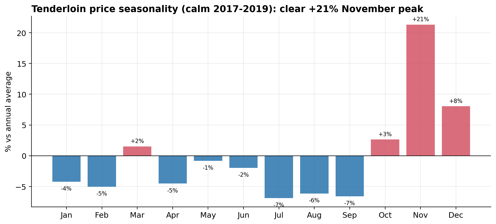
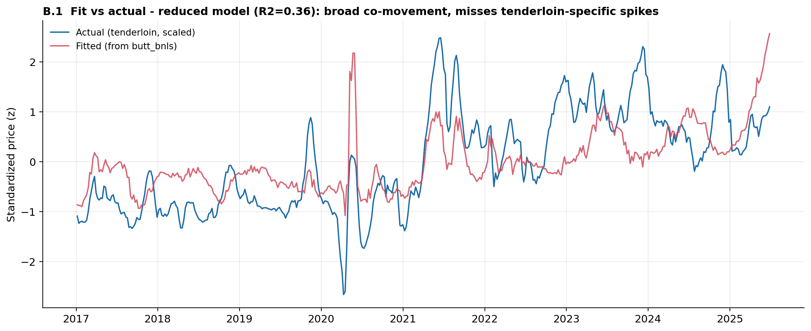
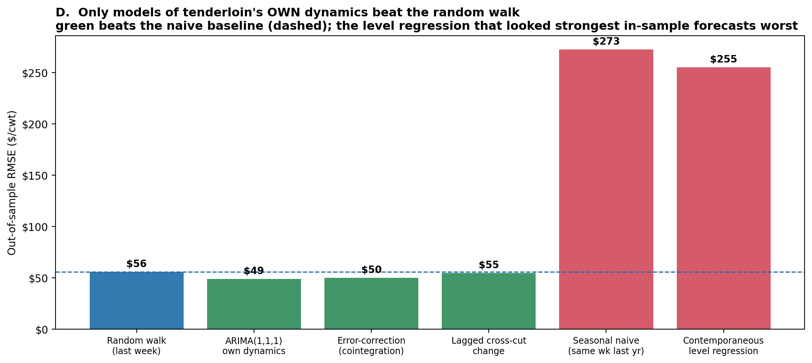
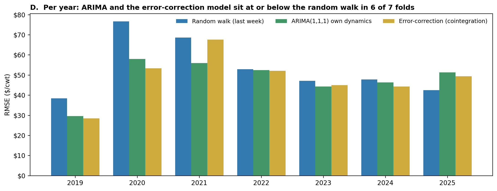

<div align="center">

# Beef Price Forecasting

**A time-series forecasting study on USDA weekly beef prices — from leakage-aware cleaning to honest backtesting.**

[](https://www.python.org/)
[](https://jupyter.org/)
[](https://www.statsmodels.org/)
[](LICENSE)

</div>

## Research question

Can weekly USDA beef cutout prices be forecast out of sample — and specifically, do closely related cuts help predict the price of tenderloin, or can any model beat a naive *"next week = this week"* baseline?

## Key finding

**No model built on the related cuts forecasts tenderloin.** A level regression on the two top-butt cuts looks strong in-sample (R² ≈ 0.37) yet turns out to be the *worst* out-of-sample forecaster, losing badly to the naive baseline. The cuts are genuinely **cointegrated** — they share a real long-run equilibrium — but that equilibrium carries **no short-run forecasting power**. The only models that beat the random walk are those built on tenderloin's *own* week-to-week dynamics (ARIMA, error-correction), and only by a **modest, consistent ~12%**. In short, tenderloin behaves like a near-random-walk: the honest forecast is *"about the same as last week,"* and the only durable edge is small and comes from the series itself — not its neighbors.

The rest of this README shows how the data and code arrive at that conclusion.



## The data

USDA weekly prices and volumes for three beef cuts — tenderloin (189A 4), top butt CC (184B 3),
and top butt boneless (184 1), 2001–2025. After cleaning, the analysis runs on a gap-free
**444-week panel (2017–2025)**.

## Cleaning without leakage

Three kinds of missingness, three deliberate fixes:

- a placeholder **\$0 price isn't a quote**, so it becomes `NaN`;
- one series is **absent for its first 16 years** — discarded rather than imputed;
- the few short post-2017 gaps are **forward-filled**, carrying only past values forward so no future information leaks into a forecasting panel.

## What the data shows

The exploratory pass surfaces real structure: a clear **+21% November seasonal peak** in the calm years, the spring-2020 COVID shock, and a structural step-up to a higher price regime around 2021.



## A model that fits — but does it forecast?

The brief asks for a linear regression, so the first model predicts tenderloin from the two top-butt cuts. In-sample it looks convincing: the cuts explain ~37% of tenderloin's variance and the fit tracks the broad co-movement.



But in-sample fit is not forecasting skill. Two diagnostics explain why this model can't be trusted forward:

- **The price levels are highly persistent.** ADF cannot reject a unit root for the butt cuts (p = 0.74, 0.30) and rejects only marginally for tenderloin (p = 0.04); KPSS rejects stationarity for all three; and every first difference is firmly stationary — so the series behave as **I(1)**. Regressing one such level on another is the classic setup for a spurious result (the residuals' Durbin–Watson of ~0.08 is the warning sign).
- **But the cuts are cointegrated.** Engle–Granger rejects no-cointegration (p ≈ 0.005), so the strong fit was *not* a spurious-regression artifact — there is a real long-run equilibrium. The open question becomes whether that equilibrium has any *forecasting* value.

## The verdict: a 1-step-ahead horse race

To answer it, six models are scored the way a forecaster actually operates — a genuine 1-step-ahead, expanding-window walk-forward (2019–2025), always predicting forward from past-only data, against the naive last-week baseline.



- The **contemporaneous level regression (\$255)** — the one that looked strongest in-sample — and a **seasonal-naive (\$272)** are the *worst* forecasters; the November seasonality is real but swamped by the regime shifts.
- Using **last week's butt move to predict tenderloin (\$55)** barely matches the naive baseline: the co-movement is contemporaneous, not predictive.
- Only **tenderloin's own dynamics win.** ARIMA(1,1,1) cuts RMSE from the random walk's **\$56 to \$49 (−12%)**, and an **error-correction model** that exploits the cointegration matches it (\$50).

And the edge is consistent rather than a lucky fold — ARIMA and the error-correction model sit at or below the random walk in **6 of 7 years**.



## Final finding

Tenderloin is a near-random-walk that shares a genuine long-run equilibrium with the other beef cuts but carries no exploitable short-run cross-signal. A regression on related cuts can *explain* co-movement but cannot *forecast* it — out of sample it is beaten decisively by simply assuming next week looks like this week. The only durable improvement, a modest but robust ~12%, comes from modeling the cut's own week-to-week dynamics. The headline lesson is the gap between a model that **fits** and a model that **forecasts** — and why an honest walk-forward against a naive baseline is the test that separates them.

## What this project demonstrates

| Skill | Where it shows up |
|---|---|
| Data cleaning & **leakage-aware** imputation | [Part A](Part_A_Analysis.ipynb) |
| EDA — seasonality, distributions, outlier detection | [Part A](Part_A_Analysis.ipynb) |
| OLS, standardization, multicollinearity diagnostics | [Part B](Part_B_Modeling_and_Part_C_cross_val.ipynb) |
| Walk-forward cross-validation vs. baselines | [Part C](Part_B_Modeling_and_Part_C_cross_val.ipynb) |
| Stationarity & cointegration testing (ADF, KPSS, Engle–Granger) | [Beyond the brief](Part_B_Modeling_and_Part_C_cross_val.ipynb) |
| ARIMA & error-correction (ECM) forecasting | [Beyond the brief](Part_B_Modeling_and_Part_C_cross_val.ipynb) |

## Repository structure

| Path | Description |
|---|---|
| [`Part_A_Analysis.ipynb`](Part_A_Analysis.ipynb) | Data cleaning + exploratory analysis |
| [`Part_B_Modeling_and_Part_C_cross_val.ipynb`](Part_B_Modeling_and_Part_C_cross_val.ipynb) | Regression, walk-forward CV, and the stationarity / cointegration / ARIMA extension |
| [`Exercise_Brief.pdf`](Exercise_Brief.pdf) | The exercise brief |
| `data/beef_data.csv` | Source data — keep the `data/` folder next to the notebooks |
| `plots/` | Exported figures |

## Run it

```bash
pip install -r requirements.txt
jupyter lab     # then open a notebook and run top to bottom
```

Each notebook is **self-contained** — it loads and cleans the data on its own. (Requires Python 3.9+; the first cell auto-installs any missing packages.)

---

<div align="center">
<sub>Built by <b>Austin Belman</b> · USDA beef cutout data · Released under the <a href="LICENSE">MIT License</a></sub>
</div>
