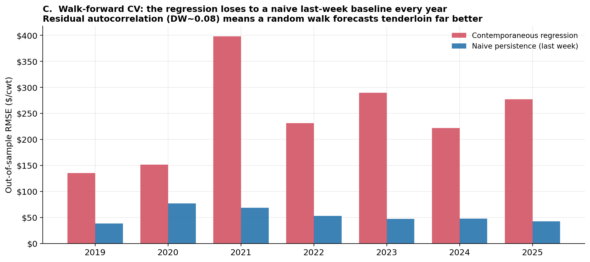

<div align="center">

# 🥩 Beef Price Forecasting

**A time-series forecasting exercise on USDA weekly beef prices — from leakage-aware cleaning to honest backtesting.**

[](https://www.python.org/)
[](https://jupyter.org/)
[](https://www.statsmodels.org/)
[](LICENSE)

</div>

> **The question:** can a simple regression forecast weekly beef prices better than just assuming *"same as last week"*?
> Built on 24 years of USDA cutout data — and candid about the answer.


---

## TL;DR

- 🧹 **Turned 16 years of messy USDA data into a leak-free weekly panel** — placeholder \$0 prices recoded to `NaN`, an un-imputable 16-year gap discarded instead of faked, and short gaps forward-filled with *past-only* information.
- 🔎 **EDA that surfaces real structure** — a **+21% November seasonal peak**, the spring-2020 COVID shock, and a step-up to a higher price regime around 2021.
- 📈 **Built a standardized OLS forecaster, then stress-tested it honestly** — and it **loses to a naive "last week" baseline** out of sample. Saying so is the point.

---

## The data

USDA weekly prices and volumes for three beef cuts — tenderloin (189A 4), top butt CC (184B 3),
and top butt boneless (184 1), 2001–2025. The notebooks trim the raw history to a clean,
gap-free **444-week panel (2017–2025)**.

## Cleaning without leakage

Three kinds of missingness, three deliberate fixes:

- a placeholder **\$0 price isn't a quote**, so it becomes `NaN`;
- one series is **absent for its first 16 years** — discarded rather than imputed;
- the few short post-2017 gaps are **forward-filled**, carrying only past values forward so no future data leaks into a forecasting panel.

## Exploratory analysis

A clear **+21% November seasonal peak** in the calm years, the **spring-2020 COVID shock**, and a structural **step-up to a higher price level around 2021**.


## Modeling & honest backtesting

A standardized **OLS** model predicts tenderloin from the two top-butt cuts, then **walk-forward (rolling-origin) cross-validation** tests it the way it would actually run — always forecasting forward from past-only data, benchmarked against a naive last-week baseline.

> **The honest finding:** in-sample the model looks strong (**R² ≈ 0.37**), but a genuine, look-ahead-free forecast **loses to naive last-week persistence in all 7 folds** (~\$243 vs. ~\$53 average RMSE). In-sample fit ≠ forecasting skill — and a portfolio piece should show that, not bury it.



---

## What this project demonstrates

| Skill | Where it shows up |
|---|---|
| Data cleaning & **leakage-aware** imputation | [Part A](Part_A_Analysis.ipynb) |
| EDA — seasonality, distributions, outlier detection | [Part A](Part_A_Analysis.ipynb) |
| OLS, standardization, multicollinearity diagnostics | [Part B](Part_B_Modeling_and_Part_C_cross_val.ipynb) |
| Walk-forward cross-validation vs. baselines | [Part C](Part_B_Modeling_and_Part_C_cross_val.ipynb) |

## Repository structure

| Path | Description |
|---|---|
| [`Part_A_Analysis.ipynb`](Part_A_Analysis.ipynb) | Data cleaning + exploratory analysis |
| [`Part_B_Modeling_and_Part_C_cross_val.ipynb`](Part_B_Modeling_and_Part_C_cross_val.ipynb) | Linear-regression model + walk-forward cross-validation |
| [`Exercise_Brief.pdf`](Exercise_Brief.pdf) | The exercise brief |
| `data/beef_data.csv` | Source data — keep the `data/` folder next to the notebooks |
| `plots/` | Exported figures |

## Run it

```bash
pip install -r requirements.txt
jupyter lab     # then open a notebook and run top to bottom
```

Each notebook is **self-contained** — it loads and cleans the data on its own. (Requires Python 3.9+; the first cell auto-installs any missing packages.)

---

<div align="center">
<sub>Built by <b>Austin Belman</b> · USDA beef cutout data · Released under the <a href="LICENSE">MIT License</a></sub>
</div>
